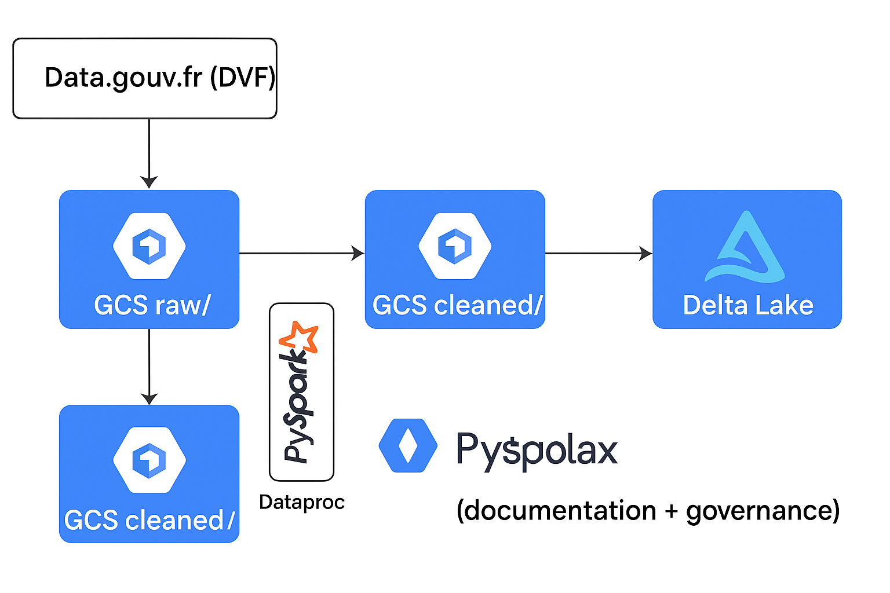

# 🏗️ Immo Data Lake — Centralisation et Analyse des Données Immobilières Françaises (DVF)

## 📘 Contexte du projet
Ce projet a été conçu dans le cadre de mon apprentissage en **Data Engineering** et vise à construire un **Data Lakehouse complet sur Google Cloud Platform (GCP)**.

L’objectif : **centraliser, nettoyer et historiser les transactions immobilières françaises (données DVF)** pour permettre des analyses temporelles (évolution des prix, surfaces, types de biens, etc.).

---

## 🧱 Architecture du projet

**Technologies principales :**
- **Google Cloud Storage (GCS)** – stockage des données brutes et traitées  
- **Dataproc (PySpark)** – traitement, nettoyage et transformation  
- **Delta Lake** – stockage optimisé, versionné, avec Time Travel  
- **Dataplex** – documentation, catalogage et gouvernance des données  

**Structure du Data Lake :**
immo-data-lake/
├── raw/ → données brutes (CSV DVF)
├── cleaned/ → données nettoyées (Parquet)
└── delta/ → tables Delta Lake partitionnées (2020–2024)

**Flux de transformation :**

**Vue d’ensemble Dataplex :**

  

---

## ⚙️ Pipeline de traitement

### 1️⃣ Ingestion (Raw Zone)
Téléchargement automatique des fichiers DVF (2020–2025) depuis [data.gouv.fr](https://www.data.gouv.fr/fr/datasets/demandes-de-valeurs-foncieres/), stockage dans **GCS (raw/)**.

> Script : [`scripts/dvf_ingest.py`](scripts/dvf_ingest.py)

### 2️⃣ Nettoyage (Cleaned Zone)
Traitement PySpark sur Dataproc :
- Lecture des fichiers bruts CSV
- Sélection et normalisation des colonnes
- Conversion en Parquet

> Script : [`scripts/clean_dvf.py`](scripts/clean_dvf.py)

### 3️⃣ Stockage Delta Lake (Delta Zone)
Création d’une table Delta partitionnée par `annee` et `code_commune`, avec gestion des versions.

> Script : [`scripts/create_delta_table.py`](scripts/create_delta_table.py)

---

## 🧭 Gouvernance & Documentation (Dataplex)

Les données sont intégrées dans **Dataplex** :
- **Lake** : `immo-lake`
- **Zones** : `raw-zone`, `cleaned-zone`, `delta-zone`
- **Assets GCS** : reliés automatiquement avec détection du schéma
- **Tags** : source, owner, description, date de mise à jour
- **Découverte automatique** : scan toutes les 12h

📘 Documentation Dataplex : [`dataplex/lake_config.md`](dataplex/lake_config.md)

---

## 📊 Exemple d’analyse (Notebook)

Un notebook Jupyter permet d’explorer les données Delta :
- Moyenne du prix au m² par commune et année
- Comparaison d’évolution sur 6 mois
- Agrégations temporelles via SparkSQL

> Notebook : [`notebooks/dvf_analysis_example.ipynb`](notebooks/dvf_analysis_example.ipynb)

---

## 🧾 Exemple de résultats

| Année | Commune                | Prix moyen au m² (€) | Nb ventes |
|--------|------------------------|-----------------------|------------|
| 2020 | Lyon                   | 5150                 | 1125 |
| 2021 | Nantes                 | 3970                 | 948 |
| 2022 | Bordeaux               | 4680                 | 1021 |
| 2023 | Marseille              | 3650                 | 1342 |

*(Résultats calculés sur un échantillon simplifié)*

---

## 🧰 Stack technique

| Composant | Technologie |
|------------|-------------|
| Cloud | Google Cloud Platform (GCP) |
| Stockage | Google Cloud Storage |
| Traitement | Apache Spark (Dataproc) |
| Format | Parquet + Delta Lake |
| Gouvernance | Dataplex |
| Langage | Python (PySpark) |
| Visualisation | Jupyter / SQL |

---

## 🧑‍💻 Auteur
👤 **Deymar** — Étudiant en Master 1 Data Engineering à Webtech INSTITUTE  
🎯 Passionné par le Big Data, les architectures Cloud et la DataOps  
📫 [LinkedIn](#) | [GitHub](#)

---

## 📚 À propos
Ce projet s’inscrit dans une démarche d’apprentissage visant à :
- comprendre les principes du Data Lakehouse moderne,
- maîtriser les pipelines PySpark sur Dataproc,
- apprendre la gouvernance des données avec Dataplex.

